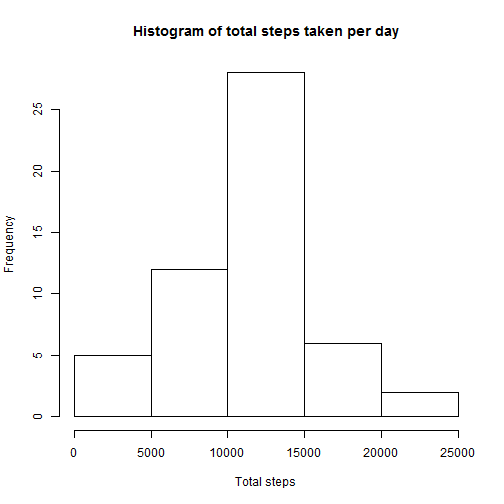
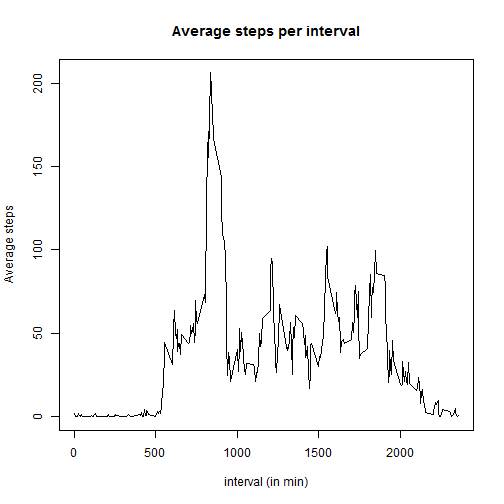
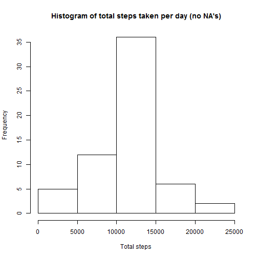
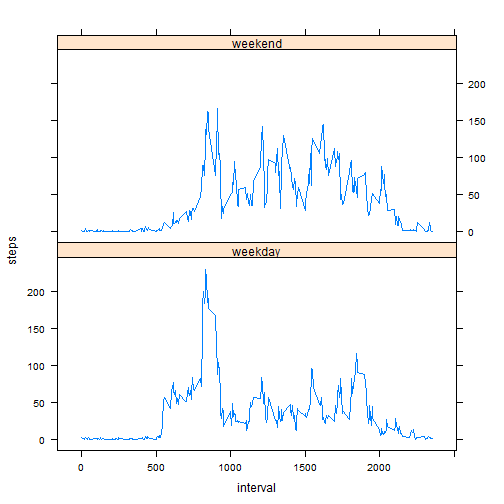

# Reproducible Research: Peer Assessment 1

## Loading and preprocessing the data

```r
## Load data, no formatting required
mydata <- read.csv("activity.csv")
```


## What is mean total number of steps taken per day?

```r
## Draw histogram
myresult <- tapply(mydata$steps,mydata$date,sum)
steps <- as.vector(myresult)
hist(steps, main="Histogram of total steps taken per day",
     xlab="Total steps")
```

 

```r
## Show mean and median
print(paste("Mean: ", format(mean(steps, na.rm=TRUE), nsmall=2)))
```

```
## [1] "Mean:  10766.19"
```

```r
print(paste("Median: ", format(median(steps, na.rm=TRUE), nsmall=2)))
```

```
## [1] "Median:  10765"
```

## What is the average daily activity pattern?

```r
## Plot time series of 5-min interval and average steps taken
myresult2 <- tapply(mydata$steps, mydata$interval, mean, na.rm=TRUE)
plot(as.numeric(names(myresult2)), as.vector(myresult2), 
     type="l", main="Average steps per interval", 
     xlab="interval (in min)", ylab="Average steps")
```

 

```r
## Show which 5-min interval contains max. number of steps
print(paste("Interval for max number of steps: ", names(which.max(myresult2))))
```

```
## [1] "Interval for max number of steps:  835"
```

## Imputing missing values

```r
## Report total number of missing values in the dataset
print(paste("Total number of missing values in the dataset:", sum(!complete.cases(mydata))))
```

```
## [1] "Total number of missing values in the dataset: 2304"
```

```r
## Fill in missing values using mean for that time interval
## Store as new dataset
newdata <- mydata

for (n in 1:nrow(newdata)) {
     if (is.na(newdata$steps[n])) {
          newdata$steps[n] <- myresult2[as.character(newdata$interval[n])]
     }    
}


## Histogram of new data set for total number of steps take neach day
newresult <- tapply(newdata$steps,newdata$date,sum)
newsteps <- as.vector(newresult)
hist(as.vector(newresult), 
     main="Histogram of total steps taken per day (no NA's)",
     xlab="Total steps")
```

 

```r
## Show mean and median total number of steps taken per day
print(paste("Mean (no NA's): ", format(mean(newsteps, na.rm=TRUE), nsmall=2)))
```

```
## [1] "Mean (no NA's):  10766.19"
```

```r
print(paste("Median (no NA's): ", format(median(newsteps, na.rm=TRUE), nsmall=2)))
```

```
## [1] "Median (no NA's):  10766.19"
```

## Are there differences in activity patterns between weekdays and weekends?

```r
## Create factor in new data set with two levels "weekday" & "weekend"
dayofweek <- as.POSIXlt(newdata$date)$wday %% 6
dayofweek[dayofweek > 0] <- "weekday"
dayofweek[dayofweek == 0] <- "weekend"
newdata <- cbind(newdata, as.factor(dayofweek))
head(newdata)
```

```
##     steps       date interval as.factor(dayofweek)
## 1 1.71698 2012-10-01        0              weekday
## 2 0.33962 2012-10-01        5              weekday
## 3 0.13208 2012-10-01       10              weekday
## 4 0.15094 2012-10-01       15              weekday
## 5 0.07547 2012-10-01       20              weekday
## 6 2.09434 2012-10-01       25              weekday
```

```r
## Generate panel plot containing time series plot of avg # of steps
## averaged across weekday days or weekend days
## Using data from the new data set (no NA's)
library(lattice)

s <- aggregate(steps ~ interval*dayofweek, 
               data=newdata, FUN=mean, simplify=FALSE)

xyplot(steps ~ interval|dayofweek, data=s, panel = panel.lines, layout=c(1,2))
```

 
